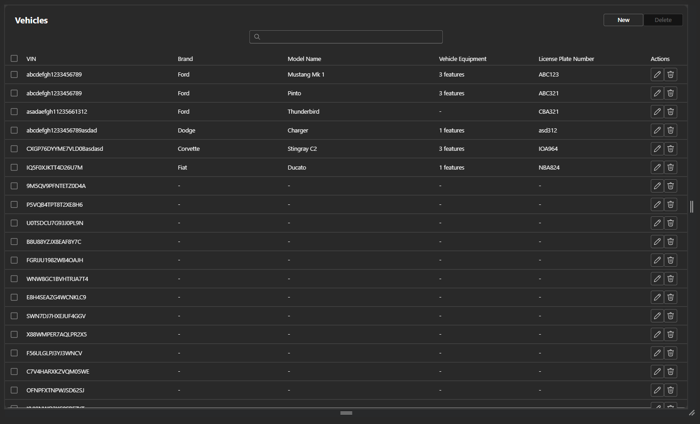
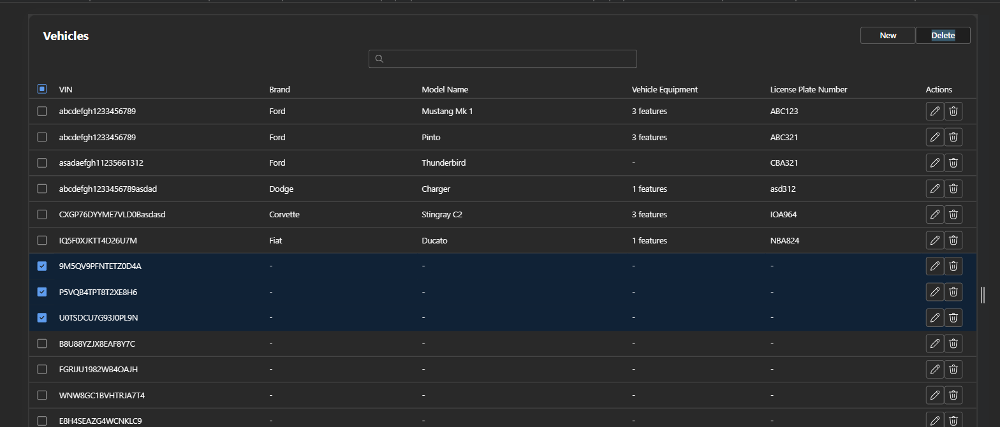
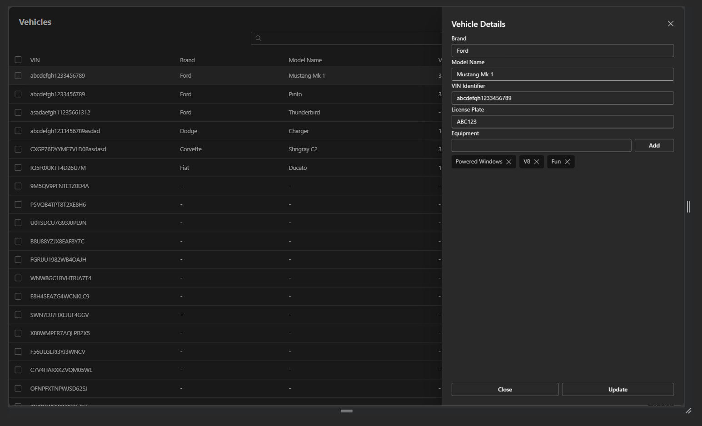
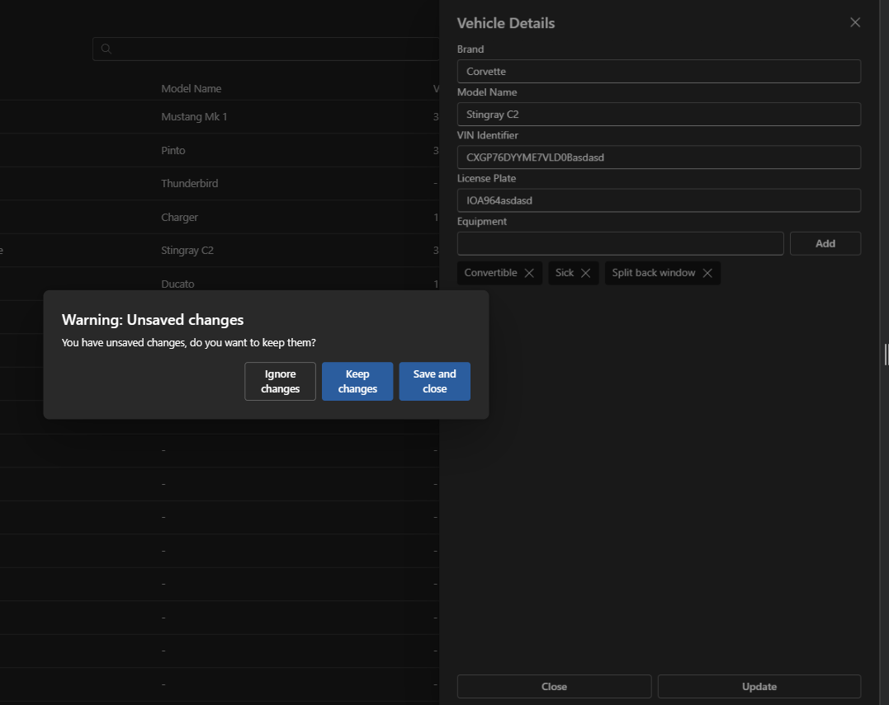
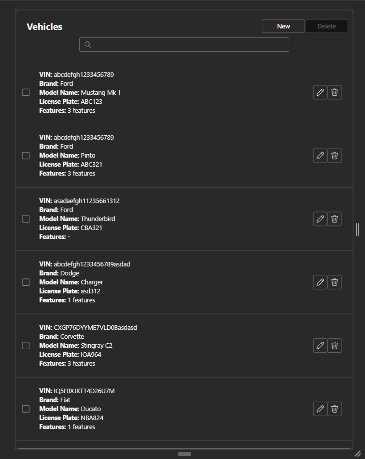
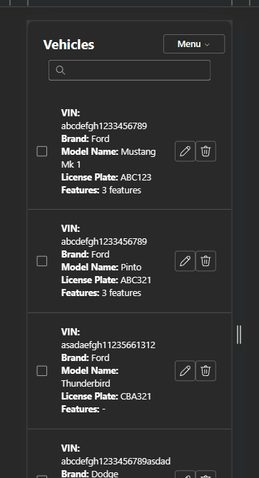
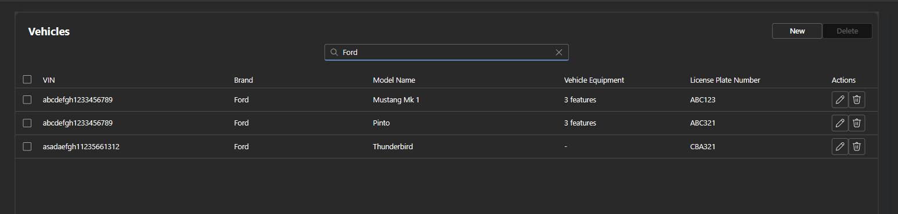

# README

Lösningen är skriven av Casper Strand

## Backend

Uppsatt i EntityFramework i .NET Core enligt instruktionerna, code-first datamodeller och nyttiga API-endpoints för allt som behövs.

För att få igång detta

Du behöver .NET Core installerat och sen behöver du EF paketet för att fixa databas/EF-bitarna:

```
dotnet tool install --global dotnet-ef
```

Sen för att initiera databasen, kontrollera ./Backend/AppSettings.json > DefaultConnection så att ni pekar på en giltig connectionstring.

Min ser ut så här `Server=localhost\\SQLEXPRESS;Database=vehicledb;Trusted_Connection=True;TrustServerCertificate=True;`

```
cd ./Backend
dotnet ef migrations add InitialCreate
dotnet ef database update
```

Sedan för att köra backenden:

```
cd ./Backend
dotnet run
```

Sen kan du se ifall allt lirar på 

https://localhost:7262/api/vehicles/hello 

som bör returnera en standard "Hello World!", det finns även en Postman collections export man kan köra med i rooten av repot

## Frontend

Denna är uppsatt i React då det är den jag är mest erfaren i även om jag har jobbat med andra JS Framework flavors också (Vue, Svelte, diverse React spin-offs - you name it).

Frontend så tog jag lite risk men tänkte jag får prova något nytt så körde med Microsofts Fluent UI kit för första gången (ett CSS Ramverk som känns som native Windows), och stöttade upp det med hands-on CSS styling vid behov. 

- https://developer.microsoft.com/en-us/fluentui#/get-started/web

För att köra detta så behöver du exekvera följande:

```
cd ./Frontend
npm install
npm start
```

Frontend kräver att backend redan kör för API-anropen ska fungera

### Förbättringsområden:

I mån av att få iväg detta inom en rimlig tid så har jag noterar jag här istället några områden man hade kunnat förbättra:

- Refaktorisera VehicleList och VehicleDetailsDrawer då de blev lite packade
- Virtualization i DataGriden, förbättrad prestanda vid stora mängder vehicle entries
- Lägga in toasts (https://react.fluentui.dev/?path=/docs/components-toast--default) så användaren får bekräftelse på att man har sparat/tagit bort eller visar om något gick fel.
- Förbättrad UX och input
    - exempelvis kunna klicka Enter på att lägga in nya taggar på Vehicle Equipment.
    - Auto-complete på taggarna, Brand och Modelname fälten, hämtar samtliga av motsvarande fält i databasen och låter dessa agera som CVL:er (Custom Value Lists, så att man inte riskerar stavfel - så länge de befintliga är rätt)
    - Ctrl+Z & Ctrl+Y och annan standard-input.
- Fixera datafältens headers till toppen oavsett vart man scrollar, på så sätt har man alltid koll på vilken header en kolumn är till för.
- Något mer robust sätt att hantera CSS samt kanske nyttja SASS vid ökad komplexitet, då man riskerar att trickla ner css-regler så som jag lagt ut det (men gjort så för att spara tid)
- Lägga in ett globalt error-handling lager, så att appen aldrig kraschar ut helt utan felet kan hanteras och återrapporteras
- Användarbekräftelse vid borttaggning av valda rader
- Se över Node.js felen, flertal high-severity issues vid npm install från FluentUI paketen (men nu var jag illa tvungen att testa FluentUI CSS ramverket 😅).
- Accessibility, applicera aria-labels med mera på lämpliga ställen
- Addera fler fält som kan vara nyttiga:
    - Årtal
    - Tidigare ägare
    - Miltal
    - m.fl.

# Överblick av Frontend

Snabb överblick av de olika momenten

Huvudvyn, här ser man en topbar med titel, sökfält som knappar för att lägga in en ny vehicle samt att ta bort flera samtidigt om man har bockat i några (om inga är valda blir knappen disabled).



Här en demonstration av hur det ser ut om man skulle ta bort några rader, notera att knappen nu inte längre är disabled



Demonstration av editorn, notera att lösningen för vehicle equipment liknar ett tagg-system



Glömmer man spara när man på något sätt klickar ifrån så blockeras detta så man hinner rädda sina ändringar om man så vill



Mobilanpassningen fungerar fullt ut, dock ganska enkel setup då den endast bryter vid 1280px



Notera att även menyn kollapsar om skärmen är riktigt smal



Och självfallet så finns det även en fungerande sök, inte superavancerat men filtrerar vehicles listan där den hittar en matchning.



# Avslutande ord

Först och främst vill jag börja med att tacka för ert tålamod, hade fullt upp med flytt första veckan så tog lite längre tid att sätta mig med denna. Hoppas ni är nöjda med min insats och ser fram emot er återkoppling 🌟

Ha en fin dag!

Med vänlig hälsning,
Casper Strand